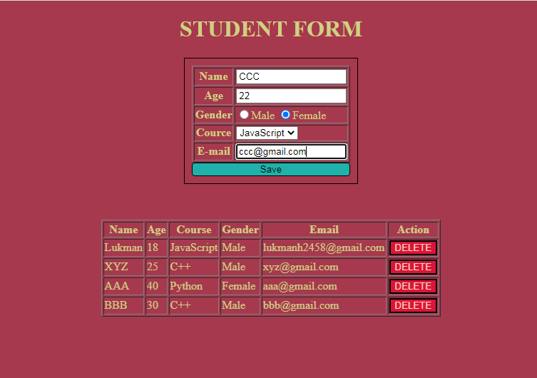

# 📝 Student Form App

A simple student form built using HTML, CSS, and JavaScript where users can enter details and manage them in a dynamic table.

## 🚀 Live Demo
🔗 https://lukman2458.github.io/js-student-form/

## 📸 Preview

## 🛠️ Features
- Add student details through form inputs
- Display data dynamically in a table
- Delete entries from the table
- Basic form handling and validation

## 📚 What I Learned
- Handling different types of user inputs
- Dynamically updating the DOM
- Creating and managing table data using JavaScript
- Implementing add and delete functionality